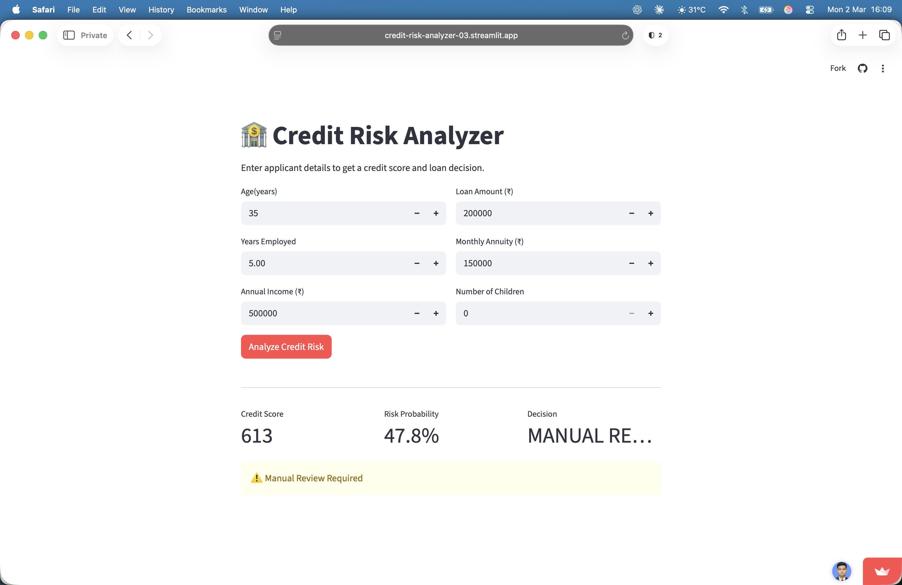

# 🏦 Alternative Credit Risk Analyzer

> ML-based alternative credit scoring system trained on **307,511 real loan applications**.  
> Predicts default risk and generates FICO-style credit scores (300–900) via a live web app and REST API.

[](https://credit-risk-analyzer-03.streamlit.app)
[](https://credit-risk-analyzer-09qq.onrender.com/docs)
[](https://python.org)
[](https://xgboost.readthedocs.io)



---

## 🎯 What This Does

Traditional credit scoring excludes millions of people who lack formal credit history. This system uses **9 key financial features** — employment history, income, annuity ratios, loan amount — extracted from a 122-feature dataset to predict default probability and assign a credit score.

Input applicant details → Get a credit score (300–900) + risk probability + loan decision in real time.

---

## 📊 Model Performance

| Model | ROC-AUC | Notes |
|-------|---------|-------|
| Logistic Regression | 0.6063 | Baseline |
| **XGBoost** | **0.6805** | **+12.3% lift over baseline** |

Dataset: [Home Credit Default Risk](https://www.kaggle.com/competitions/home-credit-default-risk/data) — 307,511 loan applications, 122 features. Not included in repo due to size.

---

## ⚙️ How It Works

1. **Data cleaning** — drops sparse columns, fixes sentinel values in employment data
2. **Feature engineering** — extracts 9 signals: age, employment years, income, credit/income ratio, annuity/income ratio, credit term, children
3. **Model training** — XGBoost classifier with class imbalance handling (`scale_pos_weight`)
4. **Score mapping** — `score = 300 + (1 - risk_probability) × 600`
5. **Serving** — FastAPI backend + Streamlit frontend for real-time scoring

---

## 🛠️ Tech Stack

| Layer | Technology |
|-------|-----------|
| ML Model | XGBoost, Scikit-learn |
| Data Processing | Pandas, NumPy |
| API Backend | FastAPI, Uvicorn |
| Web Frontend | Streamlit |
| Deployment | Streamlit Cloud, Render |

---

## 📂 Project Structure

credit-risk-analyzer/
├── app.py              # Streamlit webapp
├── main.py             # FastAPI backend
├── features.py         # Shared feature engineering logic
├── model.py            # Model training script
├── model_xgb.pkl       # Trained XGBoost model
├── model_lr.pkl        # Logistic Regression baseline
├── notebooks/          # Exploratory analysis & data exploration
├── requirements.txt    # Dependencies
└── screenshot.png      # App preview

---

## 🚀 Run Locally
```bash
git clone https://github.com/bhatt-aditya03/credit-risk-analyzer
cd credit-risk-analyzer
pip install -r requirements.txt

# Run Streamlit app
streamlit run app.py

# Or run FastAPI backend
uvicorn main:app --reload
# API available at http://localhost:8000/api/v1/predict
```

> **Note:** Dataset not included due to size. Download from [Kaggle](https://www.kaggle.com/competitions/home-credit-default-risk/data) and place as `application_train.csv` in the root directory before running `model.py`.

---

## 👨‍💻 Author

**Aditya Bhatt**